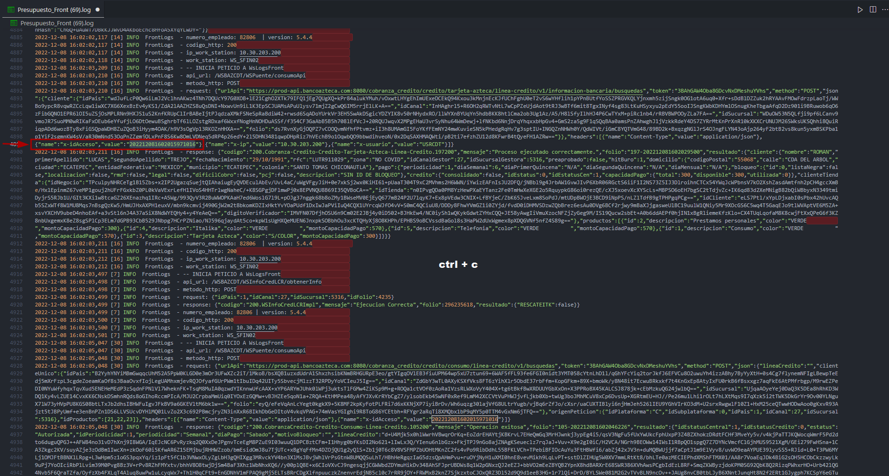
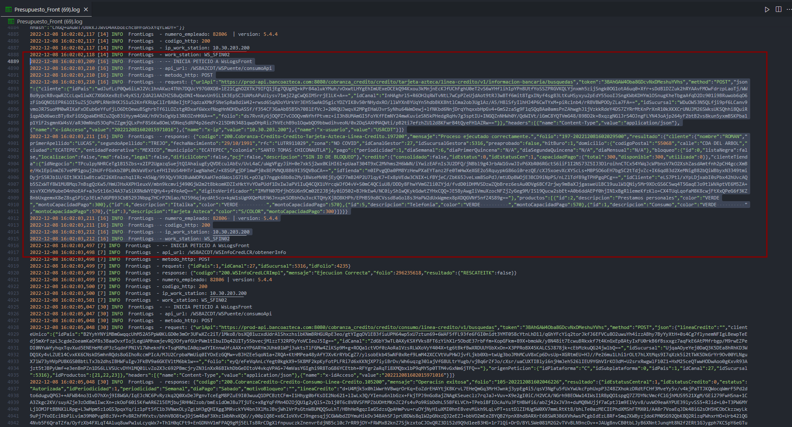
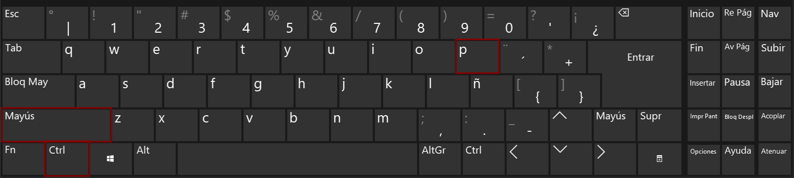
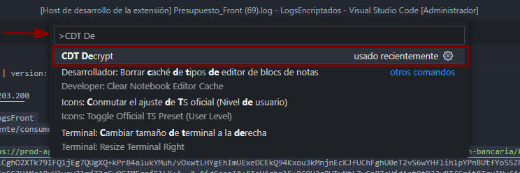
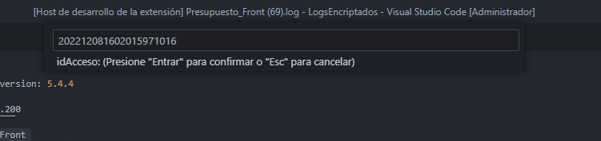
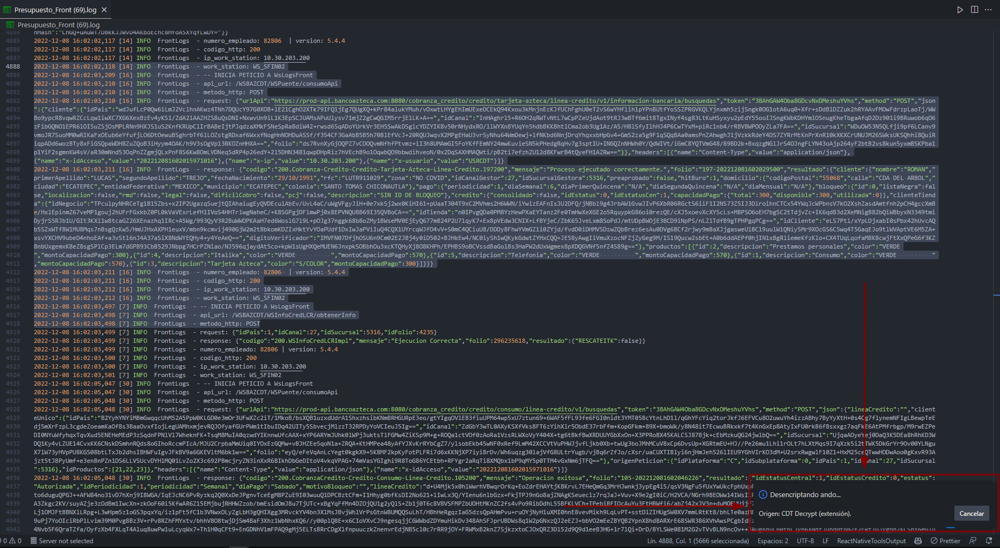
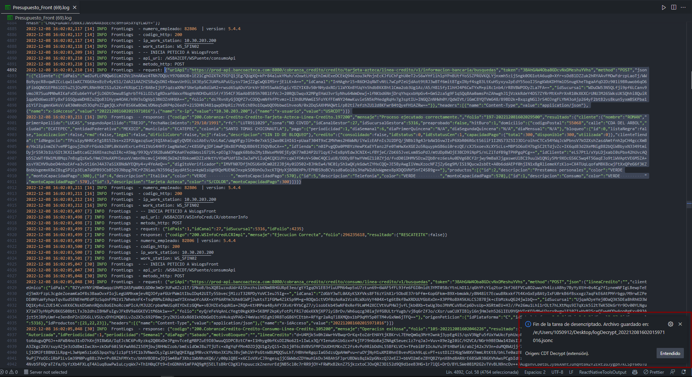
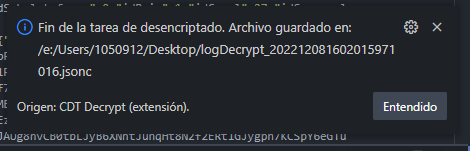
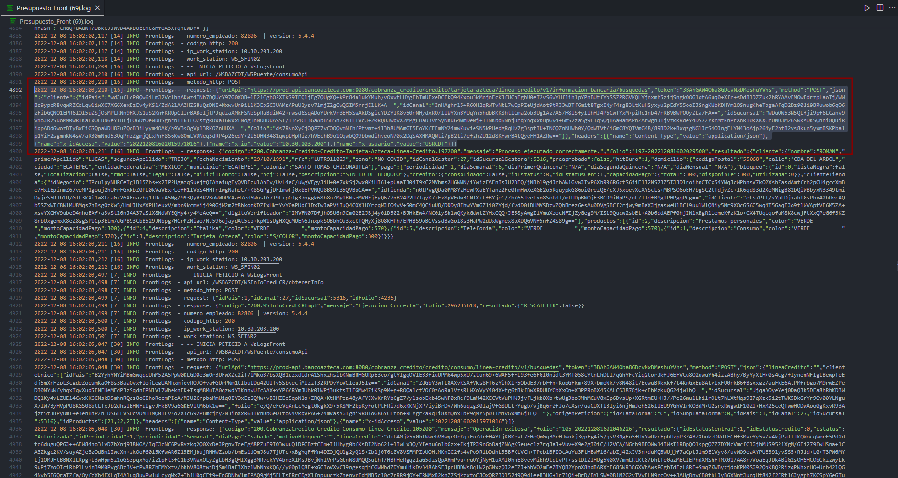
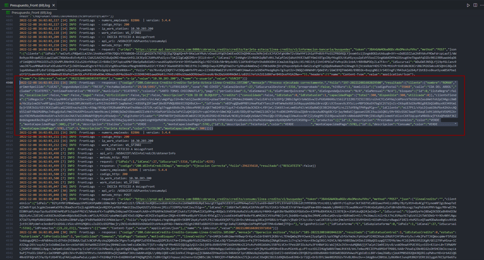

# CDT Decrypt Extension

### Herramienta para desencriptar peticiones de LOGs de manera automática, dependiente del servicio de David y su Docker que siempre se cae ¬¬

---

---

# Tipos de desencriptados a realizar

- [Request & Response](#Request-and-Response)
- [Request](#Request)
- [Response](#Response)

## Request-and-Response

<ol>
  <li>Abrir tu archivo <em>.log</em></li>
  <li>Buscar dentro del archivo el <em>request</em>, y en seguida deberías encontrar tu <em>response</em>  </li>
  <li>Una vez encontrada la parte que quieres desencriptar, debes copiar el <em><strong>idAcceso</strong></em>   (Basta con tenerlo en el portapapeles, no importa pegarlo, mientras no copies nada más en el proceso)   ** NOTA: Solo el número correspondiente al <em>value</em>, no copies todo</li>
</ol>

> &nbsp;&nbsp;&nbsp;&nbsp;&nbsp;&nbsp;&nbsp;&nbsp;&nbsp;&nbsp;&nbsp;&nbsp;&nbsp;&nbsp;&nbsp;&nbsp;&nbsp;&nbsp;&nbsp;&nbsp;&nbsp;&nbsp;&nbsp;&nbsp;&nbsp;&nbsp;&nbsp;&nbsp;&nbsp;&nbsp;&nbsp;&nbsp;&nbsp;&nbsp;&nbsp;&nbsp;&nbsp;&nbsp;&nbsp;&nbsp;&nbsp;&nbsp;&nbsp;&nbsp;&nbsp;&nbsp;&nbsp;&nbsp;&nbsp;&nbsp;&nbsp;&nbsp;&nbsp;&nbsp;&nbsp;&nbsp;&nbsp;&nbsp;&nbsp;&nbsp;&nbsp;&nbsp;&nbsp;&nbsp;&nbsp;&nbsp;&nbsp;&nbsp;&nbsp;&nbsp;&nbsp;&nbsp;&nbsp; `ctrl + c`   

<ol start=4>
  <li>Después deberás seleccionar tanto el <em>request</em> como el <em>response</em> (No importa que elijas parte de las líneas anteriores o posteriores a éstas, siempre y cuando tengas seleccionado el JSON de ambas partes <strong>COMPLETO</strong> ni elijas otro JSON externo a los que deseas desencriptar)</li>
</ol>

>   

<ol start=5>
  <li>Una vez tengas seleccionadas ambas partes, deberás presionar:</li>
</ol>

> &nbsp;&nbsp;&nbsp;&nbsp;&nbsp;&nbsp;&nbsp;&nbsp;&nbsp;&nbsp;&nbsp;&nbsp;&nbsp;&nbsp;&nbsp;&nbsp;&nbsp;&nbsp;&nbsp;&nbsp;&nbsp;&nbsp;&nbsp;&nbsp;&nbsp;&nbsp;&nbsp;&nbsp;&nbsp;&nbsp;&nbsp;&nbsp;&nbsp;&nbsp;&nbsp;&nbsp;&nbsp;&nbsp;&nbsp;&nbsp;&nbsp;&nbsp;&nbsp;&nbsp;&nbsp;&nbsp;&nbsp;&nbsp;&nbsp;&nbsp;&nbsp;&nbsp;&nbsp;&nbsp;&nbsp;&nbsp;&nbsp;&nbsp;&nbsp;&nbsp;&nbsp;&nbsp;&nbsp;&nbsp; `ctrl + shift + p`   

<ol start=6>
  <li>En el cuadro de diálogo deberás introducir: <strong>CDT Decrypt</strong>, y en la búsqueda filtrada elegir la coincidencia</li>
</ol>

>   

<ol start=7>
  <li>En el segundo cuadro de diálogo deberás pegar el <em>idAcceso</em> que tienes en el portapapeles y presionar <em>enter</em></li>
</ol>

> &nbsp;&nbsp;&nbsp;&nbsp;&nbsp;&nbsp;&nbsp;&nbsp;&nbsp;&nbsp;&nbsp;&nbsp;&nbsp;&nbsp;&nbsp;&nbsp;&nbsp;&nbsp;&nbsp;&nbsp;&nbsp;&nbsp;&nbsp;&nbsp;&nbsp;&nbsp;&nbsp;&nbsp;&nbsp;&nbsp;&nbsp;&nbsp;&nbsp;&nbsp;&nbsp;&nbsp;&nbsp;&nbsp;&nbsp;&nbsp;&nbsp;&nbsp;&nbsp;&nbsp;&nbsp;&nbsp;&nbsp;&nbsp;&nbsp;&nbsp;&nbsp;&nbsp;&nbsp;&nbsp;&nbsp;&nbsp;&nbsp;&nbsp;&nbsp;&nbsp;&nbsp;&nbsp;&nbsp;&nbsp;&nbsp;&nbsp;&nbsp;&nbsp;&nbsp;&nbsp;&nbsp;&nbsp;&nbsp; `ctrl + v`  &nbsp;&nbsp;&nbsp;&nbsp;&nbsp;&nbsp;&nbsp;&nbsp;&nbsp;&nbsp;&nbsp;&nbsp;&nbsp;&nbsp;&nbsp;&nbsp;&nbsp;&nbsp;&nbsp;&nbsp;&nbsp;&nbsp;&nbsp;&nbsp;&nbsp;&nbsp;&nbsp;&nbsp;&nbsp;&nbsp;&nbsp;&nbsp;&nbsp;&nbsp;&nbsp;&nbsp;&nbsp;&nbsp;&nbsp;&nbsp;&nbsp;&nbsp;&nbsp;&nbsp;&nbsp;&nbsp;&nbsp;&nbsp;&nbsp;&nbsp;&nbsp;&nbsp;&nbsp;&nbsp;&nbsp;&nbsp;&nbsp;&nbsp;&nbsp;&nbsp;&nbsp;&nbsp;&nbsp;&nbsp;&nbsp;&nbsp;&nbsp;&nbsp;&nbsp;&nbsp;&nbsp;&nbsp;&nbsp;&nbsp;&nbsp;&nbsp;&nbsp; `enter`  

<ol start=8>
  <li>Aparecerá un recuadro en la parte inferior derecha con el progreso, mientras éste se muestre, el proceso seguirá activo y tratando de desencriptar el texto elegido</li>
</ol>

>   

<ol start=9>
  <li>Si todo ha ido bien, deberás ver una segunda notificación en la parte inferior derecha que indicará dónde se guardó el archivo generado ya con todo el texto desencriptado</li>
</ol>

>  &nbsp;&nbsp;&nbsp;&nbsp;&nbsp;&nbsp;&nbsp;&nbsp;&nbsp;&nbsp;&nbsp;&nbsp;&nbsp;&nbsp;&nbsp;&nbsp;&nbsp;&nbsp;&nbsp;&nbsp;&nbsp;&nbsp;&nbsp;&nbsp;&nbsp;   

### Consideraciones

Si tenias un espacio de trabajo abierto en tu ventana de Visual Studio Code, será la primera opción para guardar el archivo generado que será nombrado bajo la siguiente estructura:

> `logDecrypted_[valor del idAcceso].jsonc`

Si no tenias ningún espacio de trabajo abierto, la ruta elegida para guardar el archivo será la misma en la que se encuentra tu arcivo <em>.log</em> guardado, ya sea tu carpeta de Descargas, Escritorio o donde sea que lo hayas guardado al momento de bajarlo.

## Request

Para este caso los pasos son los mismos que para [Request & Response](#Request-and-Response), a diferencia que en el paso 4 en lugar de selccionar tanto como el <em>request</em> y el <em>repsonse</em>, deberás elegir solo el JSON que corresponda al <em>request</em>, ejemplo:

>   

### Consideraciones

En este caso es más sensible la selección, por lo que deberás <strong>asegurarte</strong> de no elegir líneas extras para evitar problemas a la hora de pasar por la expresión regular, podrás elegir la primer parte que incluye la línea de la fecha, pero evita elegir más de eso, como se mostró en el ejemplo anterior.

## Response

Para este caso los pasos son los mismos que para [Request & Response](#Request-and-Response), a diferencia que en el paso 4 en lugar de selccionar tanto como el <em>request</em> y el <em>repsonse</em>, deberás elegir solo el JSON que corresponda al <em>repsonse</em>, ejemplo:

>   

### Consideraciones

En este caso es más sensible la selección, por lo que deberás <strong>asegurarte</strong> de no elegir líneas extras para evitar problemas a la hora de pasar por la expresión regular, podrás elegir la primer parte que incluye la línea de la fecha, pero evita elegir más de eso, como se mostró en el ejemplo anterior.
